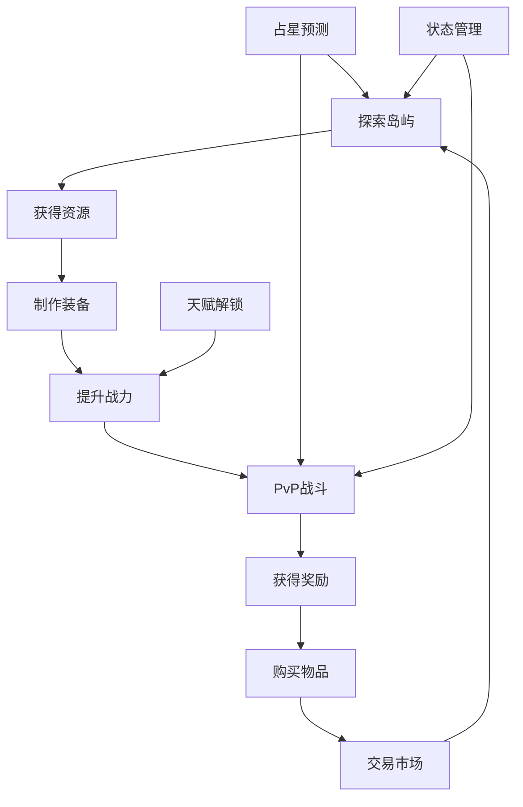

# 🌊 深海航海游戏 - 生态系统设计文档

## 🎯 重新设计理念

基于你的反馈，我重新设计了整个游戏架构，解决了以下问题：
1. **界面过于复杂** - 简化为清晰的三层结构
2. **功能缺乏联系** - 建立了完整的生态系统
3. **主次不分** - 明确了功能优先级
4. **后端逻辑缺失** - 创建了统一的状态管理系统

## 🏗️ 新架构设计

### 界面层次结构

```
顶部状态栏 (固定显示)
├── 玩家信息 (头像、姓名、船名)
├── 核心状态 (生命、理智、精力)
└── 重要资源 (金币、木料、布料)

主要内容区域
├── 左侧隐藏侧边栏 (鼠标悬停展开)
│   ├── 触发器 (⚙️ 图标)
│   └── 次要功能菜单
│       ├── 🏝️ 岛屿探索
│       ├── 🏪 交易市场  
│       ├── ⚔️ PvP战斗
│       ├── 🔮 占星系统
│       └── ✨ 天赋系统
│
├── 中央游戏区域 (主要内容)
│   ├── 游戏视窗 (剧情显示)
│   └── 快捷操作栏 (钓鱼、休息、航行)
│
└── 右侧信息面板 (辅助信息)
    ├── 📊 状态详情
    ├── 📜 航行日志
    └── 💬 聊天系统

底部通知区域 (浮动显示)
└── 实时消息提醒
```

## 🎮 功能优先级分级

### 🔴 核心主要功能 (常驻显示)
**设计原则**: 玩家最常用，必须随时可见

1. **剧情系统** - 游戏主线内容
   - 显示位置: 中央游戏区域
   - 重要性: ⭐⭐⭐⭐⭐
   - 使用频率: 持续

2. **状态监控** - 生命/理智/精力
   - 显示位置: 顶部状态栏
   - 重要性: ⭐⭐⭐⭐⭐
   - 使用频率: 持续

3. **快捷操作** - 钓鱼/休息/航行
   - 显示位置: 底部操作栏
   - 重要性: ⭐⭐⭐⭐
   - 使用频率: 高频

### 🟡 次要功能 (侧边栏)
**设计原则**: 重要但不需要常驻，按需访问

1. **岛屿探索** - 资源收集和冒险
   - 触发方式: 侧边栏选择
   - 重要性: ⭐⭐⭐⭐
   - 使用频率: 中频

2. **交易市场** - 物品买卖和社交
   - 触发方式: 侧边栏选择
   - 重要性: ⭐⭐⭐
   - 使用频率: 中频

3. **PvP战斗** - 玩家对战
   - 触发方式: 侧边栏选择
   - 重要性: ⭐⭐⭐
   - 使用频率: 低频

4. **占星系统** - 预测和信息收集
   - 触发方式: 侧边栏选择
   - 重要性: ⭐⭐⭐
   - 使用频率: 低频

5. **天赋系统** - 角色成长
   - 触发方式: 侧边栏选择
   - 重要性: ⭐⭐
   - 使用频率: 低频

### 🟢 辅助功能 (右侧面板)
**设计原则**: 信息查看和记录，不影响主要操作

1. **详细状态** - 完整的角色信息
   - 显示位置: 右侧标签页
   - 重要性: ⭐⭐⭐
   - 使用频率: 中频

2. **航行日志** - 历史记录和成就
   - 显示位置: 右侧标签页
   - 重要性: ⭐⭐
   - 使用频率: 低频

3. **聊天系统** - 社交交流
   - 显示位置: 右侧标签页
   - 重要性: ⭐⭐
   - 使用频率: 中频

## 🔗 生态系统联系

### 核心生态循环



### 系统间具体联系

#### 1. 探索 → 其他系统
- **资源获取**: 木料、食物、稀有材料
- **经验增长**: 影响等级和天赋点
- **精力消耗**: 影响后续行动能力
- **天赋进度**: 探索次数影响天赋解锁

#### 2. 交易 → 其他系统  
- **资源流通**: 买卖影响库存和金币
- **装备获取**: 购买武器提升战斗力
- **声誉系统**: 交易次数影响信誉度
- **社交网络**: 好友系统影响交易价格

#### 3. 战斗 → 其他系统
- **装备损耗**: 武器耐久度下降
- **状态影响**: 受伤影响生命和理智
- **经验奖励**: 胜利获得经验和物品
- **声誉变化**: 战斗结果影响名声

#### 4. 占星 → 其他系统
- **探索指引**: 预测宝藏位置
- **战斗预警**: 提前发现敌对船只
- **风暴预报**: 影响航行计划
- **精力消耗**: 使用占星消耗精力

#### 5. 天赋 → 其他系统
- **效率提升**: 钓鱼大师提高钓鱼效率
- **战斗加成**: 战斗天赋提高伤害
- **资源优化**: 贸易天赋降低交易成本
- **特殊能力**: 深海适应延长水下时间

## 📊 数据流向设计

### 统一状态管理 (gameEcosystem.js)

```javascript
// 核心状态
player: { health, sanity, energy, level, experience }
ship: { durability, speed, capacity, skills }
resources: { gold, wood, cloth, food, water }
inventory: [ { item, quality, durability, equipped } ]

// 功能模块状态
exploration: { islands, tools, dailyCount }
trading: { market, friends, reputation }
combat: { weapons, stats, log }
astrology: { predictions, scrying, ships }
talents: { unlocked, points, conditions }
```

### 系统间自动反应

```javascript
// 健康状态监听
watch(player.health) → 影响理智和战斗效率

// 理智状态监听  
watch(player.sanity) → 影响船只速度和行动成功率

// 船只耐久监听
watch(ship.durability) → 影响航行速度和安全性

// 资源变化监听
watch(resources) → 触发相关成就和天赋条件
```

## 🎨 用户体验优化

### 隐藏侧边栏设计
- **触发区域**: 左侧50px宽度
- **展开动画**: 0.3s缓动过渡
- **自动隐藏**: 鼠标离开后自动收起
- **视觉反馈**: 悬停时图标放大和发光

### 通知系统
- **位置**: 右上角浮动显示
- **类型**: 信息、成功、警告、错误
- **自动消失**: 3秒后自动隐藏
- **动画**: 滑入滑出效果

### 响应式适配
- **桌面端**: 完整三栏布局
- **平板端**: 侧边栏改为抽屉模式
- **手机端**: 单栏布局，功能通过底部导航切换

## 🚀 技术实现要点

### 组件通信
```javascript
// 使用 Pinia 统一状态管理
const gameStore = useGameEcosystemStore()

// 组件间通过 store 通信
gameStore.completeExploration(islandId, resources, exp)
gameStore.completeTrade(itemId, price, isBuying)
gameStore.completeCombat(result, damage)
```

### 性能优化
- **懒加载**: 次要功能组件按需加载
- **虚拟滚动**: 长列表使用虚拟滚动
- **缓存策略**: 静态数据本地缓存
- **防抖节流**: 高频操作添加防抖

### 数据持久化
```javascript
// 自动保存游戏状态
watch(gameStore.$state, (state) => {
  localStorage.setItem('gameState', JSON.stringify(state))
}, { deep: true })

// 游戏启动时恢复状态
const savedState = localStorage.getItem('gameState')
if (savedState) {
  gameStore.$patch(JSON.parse(savedState))
}
```

## 🎯 总结

新的设计解决了原有的问题：

1. **界面简洁**: 三层清晰结构，主次分明
2. **功能联系**: 完整的生态系统，相互影响
3. **优先级明确**: 核心功能常驻，次要功能按需
4. **后端完整**: 统一状态管理，自动化反应
5. **用户体验**: 隐藏侧边栏，流畅交互

这个设计既保持了游戏的丰富性，又确保了界面的简洁性和系统的连贯性。
